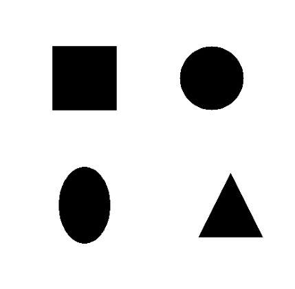
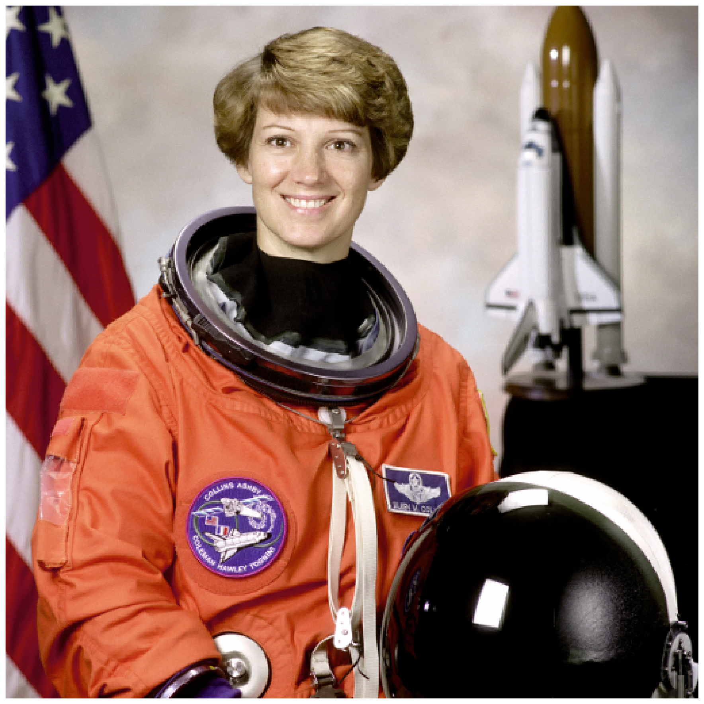
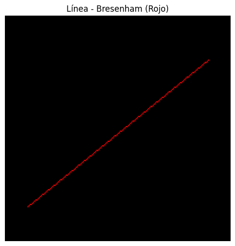
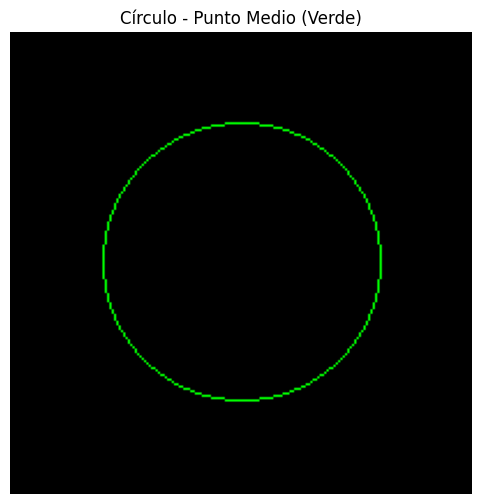
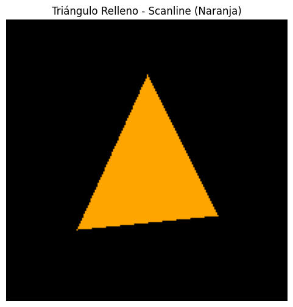

# Taller — Computación Visual & 3D  
### Jerarquías, Proyección, Raster, Visión por Computador y Generación Paramétrica  

---

# Integrantes:

Guillermo Moya Romero 
Santiago Garcia Rodriguez 
Samuel Reyes Benavides
Maria Paula Roman Arevalo

---

## 🧠 Resumen del Taller  

Este taller integra distintos módulos de **Computación Visual y 3D**, combinando los temas de **visión artificial, rasterización clásica, manipulación de píxeles y análisis geométrico**.  
Los ejercicios desarrollados buscan comprender el flujo de percepción visual (filtros, bordes y segmentación), la manipulación de imágenes a nivel de matriz y la generación de primitivas mediante algoritmos de raster.  

Durante el desarrollo se aplicaron librerías como **OpenCV**, **NumPy** y **Matplotlib** dentro de entornos de ejecución en **Google Colab**, priorizando la visualización y comparación de resultados mediante collages e imágenes animadas (GIFs).  

---

## 🧩 Ejercicios Realizados  

A continuación se documentan los **cuatro ejercicios desarrollados**, incluyendo evidencias visuales, enlaces al código, y observaciones personales.

---

### 🧿 Ejercicio 2 — Ojos Digitales (Filtros y Bordes con OpenCV)

**Objetivo:** Comprender el flujo de percepción visual aplicando filtros y detectores de bordes (Sobel, Laplaciano, etc.).  

**Descripción:**  
Se implementó la conversión de imágenes a escala de grises, se aplicaron filtros de suavizado y realce de bordes, y se compararon los resultados de Sobel X/Y y Laplaciano para distintos niveles de ruido.  

**Código:**  
🔗 [Notebook en Colab](./ejercicios/02_ojos_digitales_opencv/02_ojos_digitales_opencv.ipynb)

**Evidencia:**

  
  


**Análisis:**

Los filtros Sobel mostraron una respuesta más direccional, detectando bordes en ejes específicos, mientras que el Laplaciano fue más sensible al ruido pero permitió una detección más general de bordes.  

**Aprendizaje:**  
Se comprendió cómo cada método responde a variaciones de intensidad y cómo la suavización previa mejora la estabilidad de los bordes detectados.

---

### 🧩 Ejercicio 3 — Segmentando el Mundo (Binarización y Contornos)

**Objetivo:** Aplicar técnicas de umbralización y detección de contornos en imágenes binarias.  

**Descripción:**  
Se usaron métodos de umbralización fija y adaptativa para segmentar objetos en distintas condiciones de iluminación. Luego se calcularon centroides, perímetros y áreas usando momentos.  

**Código:**  
🔗 [Notebook en Colab](./ejercicios/03_segmentacion_umbral_contornos/03_segmentacion_umbral_contornos.ipynb)

**Evidencia:**



**Análisis:**
 
El umbral adaptativo resultó más robusto ante iluminación variable. Los momentos geométricos permitieron calcular con precisión los centroides y áreas de cada figura.  

**Aprendizaje:**  
El uso combinado de `cv2.findContours` y `cv2.moments` permite obtener métricas útiles para clasificar objetos según su geometría.

---

### 🧮 Ejercicio 4 — Imagen = Matriz (Canales, Slicing, Histogramas)

**Objetivo:** Manipular directamente los píxeles de una imagen para entender su estructura matricial y sus canales de color.  

**Descripción:**  
Se realizaron operaciones de **slicing**, separación de canales RGB y HSV, modificación selectiva de regiones, y análisis de histogramas de intensidades.  

**Código:**  
🔗 [Notebook en Colab](./ejercicios/04_imagen_matriz_pixeles/04_imagen_matriz_pixeles.ipynb)

**Evidencia:**  

  
  
  


**Análisis:**  
El acceso por índices facilita la modificación localizada de regiones. Los histogramas muestran cómo el brillo y contraste afectan la distribución tonal.  

**Aprendizaje:**  
Se reforzó el entendimiento de la imagen como una estructura matricial tridimensional (ancho × alto × canales).

---

### 🧭 Ejercicio 5 — Rasterización desde Cero (Línea, Círculo, Triángulo)

**Objetivo:** Implementar los algoritmos clásicos de rasterización sin usar funciones gráficas de alto nivel.  

**Descripción:**  
Se implementaron los algoritmos de **Bresenham** (línea), **punto medio** (círculo) y **scanline** (relleno de triángulo).  
Las figuras se graficaron usando **Matplotlib** y se analizaron diferencias en precisión y eficiencia.  

**Código:**  
🔗 [Script en Python](./ejercicios/05_rasterizacion_clasica/05_rasterizacion_clasica.ipynb)

**Evidencia:**  

  
  
  

**Análisis:**  
El algoritmo de Bresenham ofrece precisión entera y alta eficiencia al evitar operaciones de punto flotante.  
El método de punto medio demostró estabilidad en la generación de circunferencias suaves.  

**Aprendizaje:**  
Implementar rasterización manual permitió comprender el paso fundamental entre la geometría continua y su representación discreta en píxeles.

---

## ⚙️ Dependencias y Cómo Ejecutar  

### Entorno: Python (OpenCV + NumPy + Matplotlib)  
Instalar dependencias con:

```bash
pip install opencv-python numpy matplotlib
```

Luego ejecutar los notebooks en Colab o localmente con Jupyter:

```bash
jupyter notebook ejercicios/<nombre_ejercicio>/<archivo>.ipynb
```

---

## 📁 Estructura del Repositorio  

```
2025-10-xx_taller_cv_3d/
├── ejercicios/
│   ├── 02_ojos_digitales_opencv/
│   ├── 03_segmentacion_umbral_contornos/
│   ├── 04_imagen_matriz_pixeles/
│   ├── 05_rasterizacion_clasica/
├── assets/                # imágenes estáticas (antes/después, comparaciones)
├── gifs/                  # animaciones de resultados o comparaciones
├── README.md              # este documento
└── docs/                  # notas o informes adicionales
```

---

## 🙌 Créditos y Referencias  

* OpenCV Documentation — https://docs.opencv.org/  
* NumPy Documentation — https://numpy.org/doc/  
* Matplotlib Gallery — https://matplotlib.org/stable/gallery/index.html  
* Material de clase y talleres del curso **Computación Visual**  
