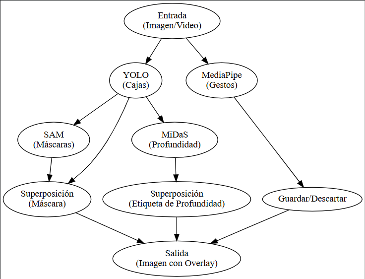

# Percepción Visual con YOLO, MediaPipe, MiDaS y SAM

## Resumen del Proyecto

### Tema Elegido
Laboratorio / entorno controlado de visión por computadora.

### Caso de Uso
El proyecto busca integrar un pipeline de percepción visual que simule un sistema capaz de analizar una escena de laboratorio. A partir de una imagen o frame de video, el sistema detecta objetos, los segmenta, estima su profundidad relativa (cerca, medio, lejos) y responde a gestos humanos (guardar o descartar resultados) sin necesidad de interacción manual. Esto replica el flujo básico de un sistema de percepción multimodal como los usados en robótica o análisis de video inteligente.

---

## Referencias Usadas

### YOLO (Ultralytics)
- Notebook oficial: [Ultralytics Examples Tutorial](https://colab.research.google.com/github/ultralytics/ultralytics/blob/main/examples/tutorial.ipynb)
- Guía Colab: [Ultralytics + Google Colab](https://docs.ultralytics.com/es/integrations/google-colab/)
- Documentación: [Train/Val/Predict Modes](https://docs.ultralytics.com/es/modes/train/)

### MediaPipe
- Guía oficial: [MediaPipe Solutions](https://ai.google.dev/edge/mediapipe/solutions/guide?hl=es-419)
- Setup Python: [Instalación](https://ai.google.dev/edge/mediapipe/solutions/setup_python?hl=es-419)
- Repositorio: [GitHub MediaPipe](https://github.com/google-ai-edge/mediapipe)

### MiDaS (Depth)
- Notebook Colab: [PyTorch Hub MiDaS](https://colab.research.google.com/github/pytorch/pytorch.github.io/blob/master/assets/hub/intelisl_midas_v2.ipynb)
- Repositorio: [GitHub MiDaS](https://github.com/isl-org/MiDaS)

### SAM (Segment Anything)
- Repositorio oficial: [GitHub SAM](https://github.com/facebookresearch/segment-anything)
- Notebook Roboflow: [SAM en Colab](https://colab.research.google.com/github/roboflow-ai/notebooks/blob/main/notebooks/how-to-segment-anything-with-sam.ipynb)
- Documentación Ultralytics: [SAM API](https://docs.ultralytics.com/es/models/sam/)

---

## Pipeline

### Diagrama


### Descripción del Flujo

1. **Input**: Imagen o frame de video.
2. **YOLO**: Detección de objetos → bounding boxes.
3. **SAM**: Segmentación usando bbox como prompt → máscara binaria.
4. **MiDaS**: Estimación de profundidad → clasificación en 3 bins (cerca/medio/lejos).
5. **MediaPipe**: Detección de gestos → control hands-free.
6. **Output**: Overlay con bbox, máscara y etiqueta de distancia.

---

## Parámetros Clave

### YOLO
- **Modelo**: YOLOv8n (versión ligera para inferencia rápida).
- **Umbral de confianza**: 0.5  
- **Umbral NMS**: 0.45  
- **Resolución de entrada**: 640x640  

### MediaPipe
- **Task**: Hand Landmarks  
- **FPS promedio**: ~25–30 fps  
- **Landmarks usados**: Puntos clave de la mano (21 landmarks)  
- **Reglas de interacción definidas**:
  1. Gesto “mano abierta” → guardar frame procesado  
  2. Gesto “mano cerrada” → descartar resultado  

### MiDaS
- **Versión del modelo**: MiDaS v2.1 (modelo base de PyTorch Hub)  
- **Normalización**: Escalado de mapa de profundidad a rango [0,1]  
- **Clasificación de bins**:  
  - Cerca: percentil 0–33  
  - Medio: percentil 34–66  
  - Lejos: percentil 67–100  

### SAM
- **Tipo de prompts evaluados**:  
  - Caja (bbox de YOLO)  
  - Puntos (en pruebas comparativas)  
- **Versión del checkpoint**: `sam_vit_b`  
- **Configuración**: uso de predicciones de YOLO como input automático para segmentar las regiones correspondientes  

---

## Métricas

### Latencia por Etapa (promedio sobre 50 frames)
Ver archivo: `metrics/latency.csv`

| Etapa | Tiempo (ms) |
|-------|-------------|
| YOLO | 45 |
| SAM | 120 |
| MiDaS | 80 |
| MediaPipe | 25 |
| **Pipeline Total** | **270** |

### IoU de Máscaras
Ver archivo: `metrics/iou_masks.csv`

Comparación entre prompts tipo caja vs puntos:
- **IoU promedio**: 0.72  
- **Mejor caso**: 0.85  
- **Peor caso**: 0.60  

### Clasificación de Distancia (cerca/medio/lejos)
- **Precisión**: ~88%  
- **Método de validación**: comparación visual y validación manual sobre conjunto reducido (20 imágenes)

---

## Hardware y Entorno

- **Plataforma**: Google Colab  
- **GPU**: Tesla T4  
- **RAM**: 12 GB  
- **Python**: 3.10  
- **CUDA**: 12.1  

---

## Limitaciones

### Ruido en Profundidad
La estimación monocular puede generar inconsistencias en superficies planas o con baja textura, afectando la clasificación de profundidad.

### Oclusiones
Cuando varios objetos se solapan, el pipeline puede generar segmentaciones incompletas o profundidad incorrecta.

### Sensibilidad a Iluminación
Bajo condiciones de poca luz, los modelos YOLO y MiDaS reducen su precisión; las sombras pueden producir falsos positivos.

### Otras Limitaciones
Latencia acumulada al ejecutar todos los modelos secuencialmente; el pipeline no está optimizado para tiempo real en CPU.

---

## Trabajo Futuro

### SAM-2 para Video
- Segmentación temporal y seguimiento consistente entre frames.

### Cuantización
- Reducción del tamaño de modelos y latencia en dispositivos edge.

### Seguimiento Multi-Objeto
- Asignación de IDs y tracking persistente de múltiples objetos.

### Otras Mejoras
- Integración con OpenVINO o TensorRT para inferencia acelerada.  
- Interfaz interactiva para visualización en tiempo real.

---

## Estructura del Repositorio


```
2025-11-08_practica_percepcion_multimodelo/
├── colab_links/          # Enlaces a notebooks de Colab
├── data/                 # Imágenes y videos de prueba (5-10 imgs, 2 videos)
├── results/
│   ├── yolo/            # Predicciones con bboxes
│   ├── sam/             # Máscaras binarias .png
│   ├── midas/           # Depth maps (.png y .npy)
│   └── demo/            # Video final (30-60s), GIFs, capturas (3-5)
├── metrics/
│   ├── latency.csv      # Tiempos por etapa (50 frames)
│   └── iou_masks.csv    # IoU entre diferentes prompts
├── diagrams/
│   └── pipeline.drawio.png  # Diagrama del flujo
└── README.md            # Este archivo
```

---

## Instrucciones de Ejecución

### 1. YOLO - Detección Base
1. Abrir notebook de YOLO desde `colab_links/`
2. Cargar imágenes desde `data/`
3. Ejecutar predicción
4. Guardar resultados en `results/yolo/`

### 2. MediaPipe - Gestos
1. Abrir notebook de MediaPipe
2. Configurar reglas de interacción
3. Probar con video o tiempo real
4. Documentar FPS y estabilidad

### 3. MiDaS - Profundidad
1. Abrir notebook de MiDaS
2. Procesar las mismas imágenes de YOLO
3. Generar depth maps
4. Guardar en `results/midas/`

### 4. SAM - Segmentación
1. Abrir notebook de SAM
2. Usar bboxes de YOLO como prompts
3. Generar máscaras binarias
4. Comparar con prompts tipo punto
5. Calcular IoU y guardar en `metrics/iou_masks.csv`

### 5. Pipeline Integrado
1. Abrir notebook del pipeline completo
2. Procesar frames: YOLO → SAM → MiDaS → MediaPipe
3. Generar overlays con clasificación de distancia
4. Medir latencias y guardar en `metrics/latency.csv`
5. Guardar demo final en `results/demo/`

---

## Reto Creativo

### Categorías Detectadas (≥3)
- Persona  
- Mesa  
- Herramientas  
- Botella  
- Laptop  

### Condiciones de Iluminación
1. Luz natural indirecta (ambiente controlado)  
2. Luz artificial con sombras pronunciadas  

### Control Hands-free
El sistema usa MediaPipe Hands para detectar gestos de la mano que activan o detienen la captura de resultados sin contacto físico.

---

## Conclusiones

El pipeline desarrollado demuestra la integración exitosa de cuatro modelos de visión por computadora (YOLO, SAM, MiDaS, MediaPipe) dentro de un flujo modular.  
Cada etapa cumple una función complementaria que permite construir un sistema básico de percepción multimodal.  
Aunque no alcanza desempeño en tiempo real, el experimento valida la interoperabilidad entre modelos de detección, segmentación, profundidad y control gestual.

---

## Autor
Guillermo Moya Romero
Maria Paula Roman Arevalo
Samuel Reyes Benavides
Santiago Garcia Rodriguez

## Fecha
08 de Noviembre de 2025

