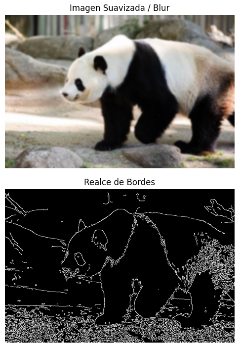
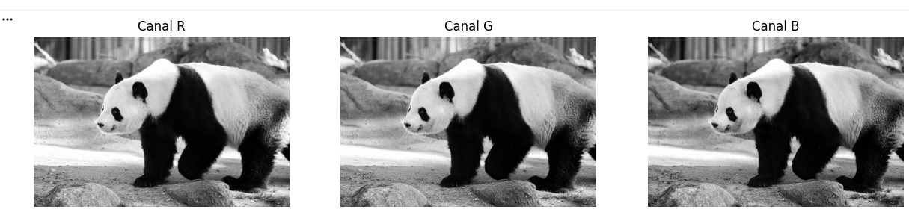
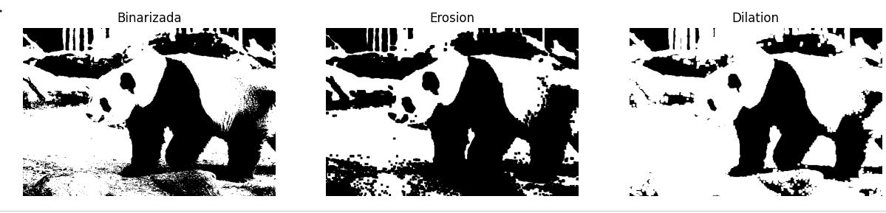
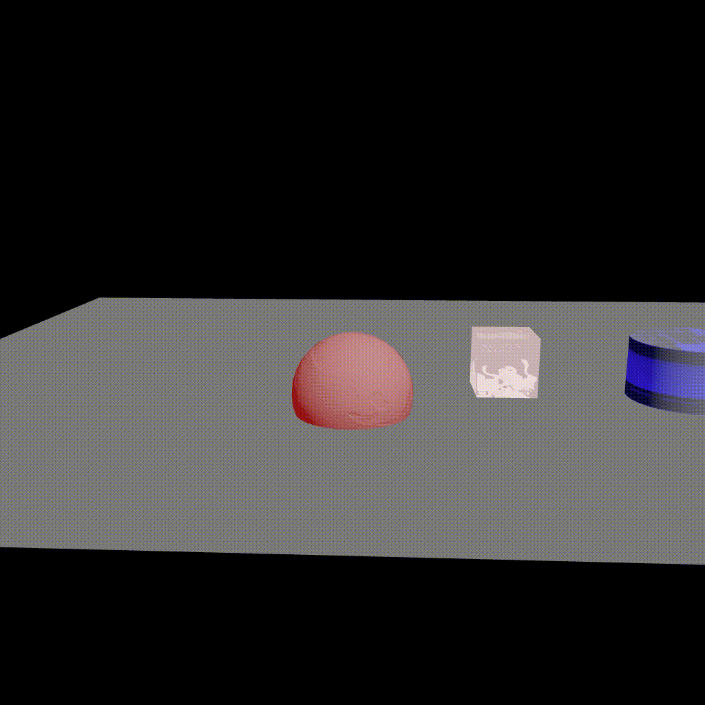
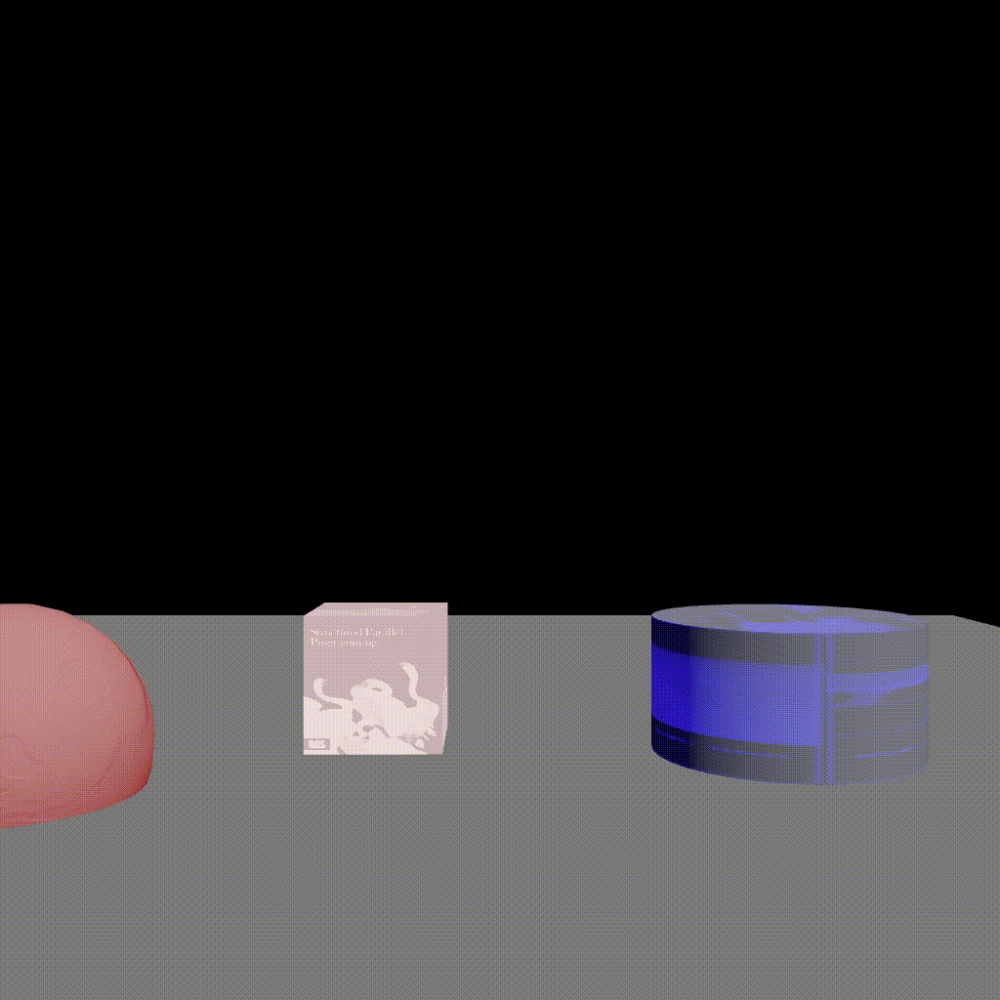

# 🐼 Examen Final – Computación Visual || Guillermo Moya Romero

Este repositorio contiene el desarrollo completo del Examen Final de la materia **Computación Visual**, dividido en dos componentes:

* **Procesamiento de imágenes en Python**
* **Escena 3D interactiva en Three.js**

A continuación se documentan los resultados, junto con GIFs demostrativos y las instrucciones para ejecutar cada parte.

---

# ## 📌 Punto 1 – Python: Procesamiento de Imágenes

En esta sección se trabajó con una imagen RGB de un animal en vía de extinción (panda gigante). Se aplicaron filtros, operaciones morfológicas, visualización de canales y generación de animaciones.

### ✔️ Actividades realizadas

* Carga y visualización de la imagen original.
* Aplicación de filtros:

  * **Desenfoque**
  * **Detección de bordes**
* Separación y análisis de canales **R, G y B**.
* Operaciones morfológicas sobre una versión binarizada:

  * **Erosión**
  * **Dilatación**
* Generación de un **GIF** mostrando la transformación progresiva de la imagen.

### 📸 Resultados

#### Imagen original, procesamientos y morfología



#### Transformaciones morfológicas





### 📝 Descripción breve

Se cargó la imagen del panda y se realizaron filtros básicos para observar cambios en textura y bordes. La separación de canales permitió identificar qué componentes de color resaltaban más las regiones claras/obscuras del animal.
Las operaciones morfológicas afectaron la estructura binarizada del panda: la erosión redujo detalles y la dilatación los expandió. Finalmente, se unificaron todos los pasos en una animación secuencial.

---

# ## 🎮 Punto 2 – Three.js: Escena 3D Interactiva

Se desarrolló una escena 3D con múltiples formas geométricas, texturas, animaciones y controles interactivos.

### ✔️ Características implementadas

* Escena completa con **cámara en perspectiva** y renderizador WebGL.
* Objetos geométricos:

  * Esfera, cubo, cilindro y otras formas básicas.
* **Texturas aplicadas** tanto al plano del suelo como a algunos objetos.
* **Dos perspectivas de cámara**, con la posibilidad de alternar entre ellas.
* **Animaciones continuas** integradas en el bucle `requestAnimationFrame`.
* Uso de **OrbitControls**, permitiendo:

  * Rotar la escena
  * Hacer zoom
  * Explorar libremente el entorno 3D

### 📸 Resultados

#### Vista general y animación



#### Cambios de cámara y movimiento



### 📝 Descripción breve

La escena está compuesta por varias geometrías distribuidas en el espacio, cada una con materiales y texturas diferentes. Se añadieron luces para mejorar el volumen y la profundidad visual.
El usuario puede moverse libremente con OrbitControls y alternar entre cámaras para observar la composición desde ángulos alternativos. Algunas figuras rotan o se desplazan como parte de la animación.

---

# ## ▶️ Instrucciones de Ejecución

### 🔹 **Punto 1 – Python**

1. Abrir la carpeta:

   ```bash
   cd examen_final/python
   ```
2. Ejecutar el notebook:

   * Desde Jupyter Notebook, VSCode o Google Colab.
   * Asegurarse de que la carpeta `data/` contenga la imagen del panda.


## ▶️ Instrucciones de Ejecución – Punto 2 (Three.js con **Three.js Editor**)

En este proyecto se utilizó el **Three.js Editor**, por lo que la escena final se exporta como un archivo **`.json`**.  
Para visualizar y trabajar con la escena, simplemente sigue estos pasos:

### 🔹 Abrir la escena en el Three.js Editor

1. Entra al editor oficial:  
   **https://threejs.org/editor**

2. Una vez dentro, selecciona en la barra superior:  
   **File → Open**

3. Busca y selecciona tu archivo exportado:  
```

examen_final/threejs/scene.json

```

4. El editor cargará automáticamente:
- La escena completa  
- Las texturas referenciadas  
- Las luces  
- Las animaciones  
- Configuraciones de cámara  

5. Para volver a abrir la escena más adelante:
- Solo ingresa nuevamente al editor  
- Y usa:  
  **File → Open → seleccionar scene.json**

### 🔹 Exportar nuevamente (opcional)

Si haces cambios y quieres guardar la versión actualizada:
- Ve a → **File → Save**  
- Reemplaza el archivo existente en tu carpeta `threejs/`.

---

---

# ✔️ Estructura del repositorio

```
examen_final/
├── python/
│   ├── examen_final_python.ipynb
├── threejs/
│   ├── scene.json
└── README.md   ← (este archivo)
```

