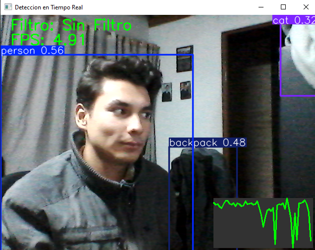
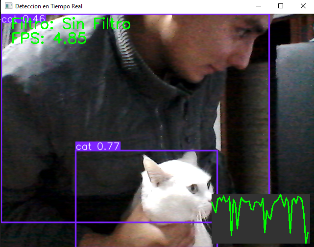

# 🧪 A. Percepción y Visión


Implementar detección en tiempo real con YOLO.


Integrar segmentación con SAM o DeepLab.


Visualizar embeddings mediante CLIP + PCA/t-SNE.


Exportar resultados como imágenes anotadas y JSON.


----------

## 💻 Python (Ejecución local con webcam)

**Herramientas necesarias:**

-   opencv-python
    
-   ultralytics
    
-   torch
    
-   numpy
    

----------

### Pasos a implementar:
-   Instalar las dependencias necesarias:
`pip install ultralytics opencv-python` 

-   Importar librerías y cargar el modelo:

``` python
from ultralytics import YOLO import cv2, time
model = YOLO('yolov8n.pt')` 
```

-   Capturar video en tiempo real:
    
```python
cap = cv2.VideoCapture(0)` 
```
-   En cada frame:
    
    -   Medir el inicio del fotograma.
        
    -   Realizar detección con `model.predict(source=frame, stream=False)`.
        
    -   Filtrar opcionalmente según el modo vigente.
        
    -   Dibujar las cajas, nombre de la detección y puntajes de confianza.
        
    -   Calcular e imprimir el **FPS**.
        
    -   Mostrar el nombre del filtro vigente junto con el FPS.
        
-   Visualizar el resultado con `cv2.imshow()`.
    
-   Utilizar teclas:
    
    -   **q** → salir
        
    -   **f** → cambiar el filtro de detección (sin filtro, person, cat, cell phone)

## 📌 Resultados

El sistema de detección en tiempo real con YOLOv8 se ejecutó correctamente sobre la webcam, mostrando:

- Detecciones con cajas delimitadoras, nombre de la clase y puntaje de confianza.
- Alternancia dinámica entre filtros (Sin Filtro, Personas, Gatos y Celular).
- Cálculo y visualización del **FPS en vivo**.
- Una gráfica de rendimiento integrada directamente en la ventana de OpenCV.
- Respuesta estable con múltiples objetos en escena, incluyendo personas y mascotas.

A continuación se muestran ejemplos obtenidos directamente durante la ejecución:

### 🖼️ Ejemplo 1 – Detección sin filtro  
La detección reconoce múltiples objetos simultáneamente (persona, backpack, etc.), junto con la gráfica dinámica de FPS.



### 🖼️ Ejemplo 2 – Detección de gato  
El sistema reconoce correctamente un gato en escena con alta confianza, incluso en condiciones de iluminación interior.



---


## 🔹 Fragmento de código relevante:

```python
# Real-time Object Detection with YOLOv8 and OpenCV
import  cv2  # Se usa OpenCV para la captura de video y visualización
import  time  # Se usa time para calcular el FPS
from ultralytics import YOLO #Se usa la librería ultralytics para cargar el modelo YOLOv8

# Carga el modelo (YOLOv8n)
model = YOLO("yolov8n.pt")

# Filtra opcionalmente según las clases que deseas detectar
filter_labels = [None, "person", "cat", "cell phone"]

# Inicializa la captura de video
cap = cv2.VideoCapture(0)

if  not  cap.isOpened():
print("Error: no se pudo acceder a la cámara.")
cap.release()
exit(1)


print("Presiona 'q' para salir")
print("Presiona 'f' para cambiar el modo de filtrado")

# Filtrado activado o desactivado
filter_index = 0

# Loop principal
try:
	while  True:
		inicio = time.time()
		ret, frame = cap.read()
		if  not  ret:
			print("Error: no se pudo leer el fotograma.")
			break

		# Realiza detección de objetos en el fotograma
		resultados = model.predict(source=frame, stream=False)
		detections = resultados[0]

		# Filtra según el modo vigente
		if  filter_labels[filter_index] is  not  None:
			filter_name = filter_labels[filter_index]
			filtered_boxes = []
			for  box  in  detections.boxes:
				class_id = int(box.cls.item()) # el id de la detección
				class_name = model.names[class_id] # nombre de la detección

				if  class_name == filter_name:
					filtered_boxes.append(box)
			detections.boxes = filtered_boxes

		# Dibuja las detecciones en el fotograma
		annotated = detections.plot()

		# Calcula el FPS
		fin = time.time()
		fps = 1.0 / (fin - inicio)
		fps_text = f"FPS: {fps:.2f}"
		
		# Muestra el modo de filtrado
		modo = filter_labels[filter_index]
		modo_txt = f"Filtro: {modo  or  'Sin Filtro'}"  

		color = (0, 255, 0) if  filter_index == 0  else (0, 0, 255)
		cv2.putText(annotated, modo_txt, (20, 30),
			fontFace=cv2.FONT_HERSHEY_SIMPLEX,
			fontScale=1, color=color, thickness=2)

		cv2.putText(annotated, fps_text, (20, 60),
			fontFace=cv2.FONT_HERSHEY_SIMPLEX,
			fontScale=1, color=color, thickness=2)

		# Muestra el resultado
		cv2.imshow("Deteccion en Tiempo Real", annotated)
		# Control con teclado
		key = cv2.waitKey(1) & 0xFF
		if  key == ord('q'): # presiona q para salir
			break
		elif  key == ord('f'): # f para cambiar el filtro
			filter_index = (filter_index + 1) % len(filter_labels)
			print(f"Filtro cambiado a: {filter_labels[filter_index] or  'Sin Filtro'}")

finally:
	cap.release()
	cv2.destroyAllWindows()
```


## 👥 Integrantes

-   Guillermo Moya Romero

-	Maria Paula Roman Arevalo

-	Samuel Reyes Benavides

-	Santiago Garcia Rodriguez