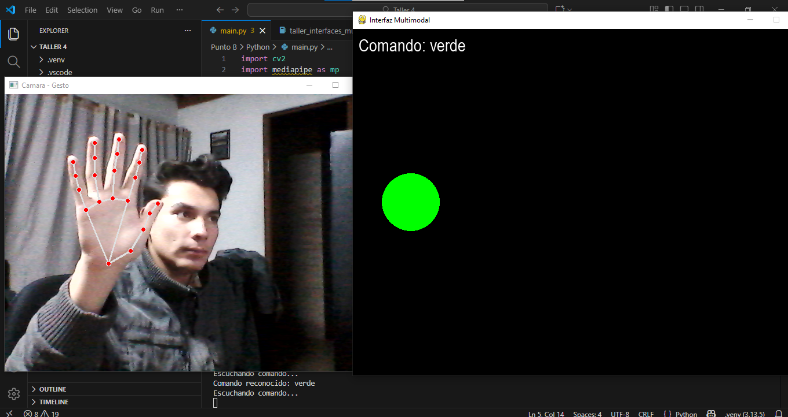
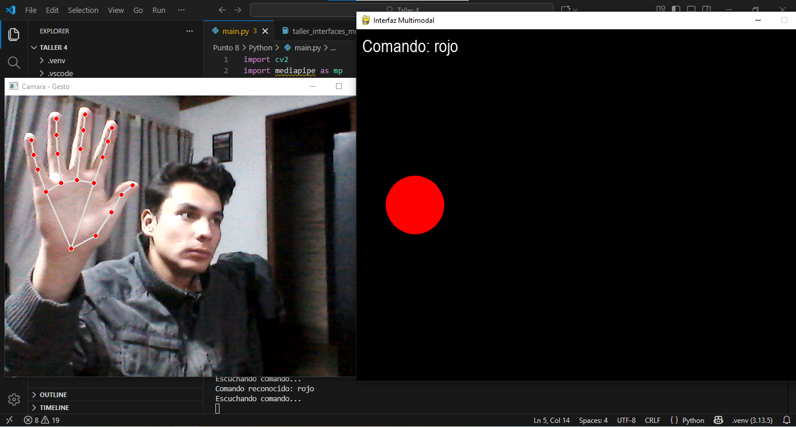
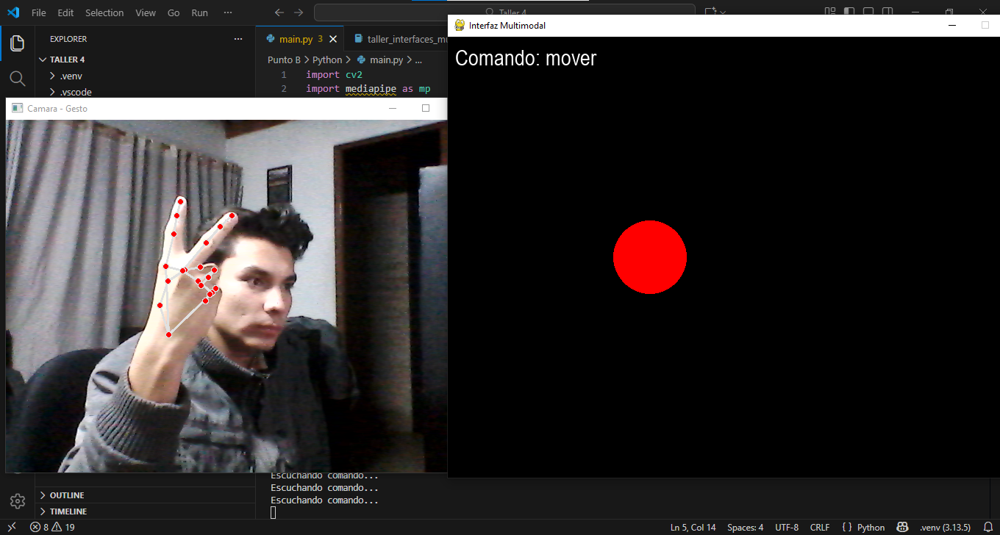
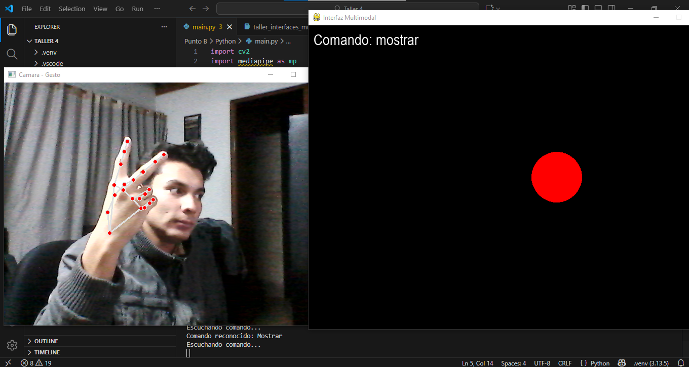

# 🧪 B. Interacción Multimodal


Detección de gestos con MediaPipe (manos, rostro o cuerpo).

Reconocimiento y síntesis de voz con SpeechRecognition y Pyttsx3.

Simulación de señales EEG y control mediante umbrales.

Fusión de entradas (voz + gestos + EEG) para activar acciones visuales.


---

## 🧠 Conceptos Aprendidos

- Detección de gestos de mano con MediaPipe.
- Reconocimiento de voz con SpeechRecognition.
- Procesamiento concurrente con hilos en Python.
- Coordinación de entradas multimodales.
- Visualización gráfica en tiempo real con Pygame.
- Sincronización entre canales de entrada.

---

## 🔧 Herramientas y Entornos

- **Lenguaje**: Python 3.x
- **Bibliotecas**:
  - `mediapipe`
  - `opencv-python`
  - `speech_recognition`
  - `pyaudio`
  - `pygame`
- **Entorno**: Local

---


---

## 🧪 Implementación

### 🔹 Etapas realizadas
1. **Captura de entrada visual y de voz**: webcam para gestos y micrófono para comandos hablados.
2. **Procesamiento simultáneo** con `threading` para voz y cámara.
3. **Lógica multimodal condicional** que actúa solo si se cumplen combinaciones específicas de gesto + comando.
4. **Visualización reactiva** en `pygame`, con retroalimentación textual y gráfica.

### 🔹 Código relevante

```python
# Fragmento central del procesamiento multimodal
if estado_gesto["mano_abierta"]:
    if "cambiar" in ultimo_comando:
        color = (0, 0, 255)
    elif "rojo" in ultimo_comando:
        color = (255, 0, 0)
    elif "verde" in ultimo_comando:
        color = (0, 255, 0)

if estado_gesto["dos_dedos"]:
    if "mover" in ultimo_comando:
        x = (x + 5) % 800
    elif "ocultar" in ultimo_comando:
        mostrar = False
    elif "mostrar" in ultimo_comando:
        mostrar = True
```
```python
  # Detección simple basada en landmarks
 if results.multi_hand_landmarks:
            for hand_landmarks in results.multi_hand_landmarks:
                mp_drawing.draw_landmarks(frame, hand_landmarks, mp_hands.HAND_CONNECTIONS)

                dedos_arriba = 0
                if hand_landmarks.landmark[8].y < hand_landmarks.landmark[6].y:
                    dedos_arriba += 1  # Índice
                if hand_landmarks.landmark[12].y < hand_landmarks.landmark[10].y:
                    dedos_arriba += 1  # Medio
                if hand_landmarks.landmark[16].y < hand_landmarks.landmark[14].y:
                    dedos_arriba += 1  # Anular
                if hand_landmarks.landmark[20].y < hand_landmarks.landmark[18].y:
                    dedos_arriba += 1  # Meñique
                if hand_landmarks.landmark[4].x < hand_landmarks.landmark[3].x:
                    dedos_arriba += 1  # Pulgar (posición relativa)

                estado_gesto["mano_abierta"] = dedos_arriba >= 4
                estado_gesto["dos_dedos"] = dedos_arriba == 2
```
---

## 📊 Resultados Visuales

### Resultados en HD en carpeta resultados






---

## 🧭 Tabla de Combinaciones Multimodales

| Gesto Detectado        | Comando de Voz  | Acción Realizada                         |
|------------------------|-----------------|------------------------------------------|
| Mano abierta           | "cambiar"       | Cambia el color del círculo a azul       |
| Mano abierta           | "rojo"          | Cambia el color del círculo a rojo       |
| Mano abierta           | "verde"         | Cambia el color del círculo a verde      |
| Dos dedos extendidos   | "mover"         | Desplaza el círculo horizontalmente      |
| Dos dedos extendidos   | "ocultar"       | Oculta el círculo de la pantalla         |
| Dos dedos extendidos   | "mostrar"       | Vuelve a mostrar el círculo              |

📝 **Nota**:  
Las acciones solo se ejecutan cuando **coinciden simultáneamente** el gesto y el comando de voz.  
Por ejemplo, decir “rojo” sin la mano abierta no genera ningún cambio.

---

---

## 👥 Integrantes

-   Guillermo Moya Romero

-	Maria Paula Roman Arevalo

-	Samuel Reyes Benavides

-	Santiago Garcia Rodriguez